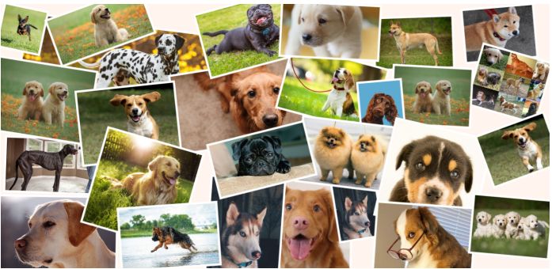

# Udacity Data Analysis Project - Extracted Twitter Sentiment for Analysis (16-03-2021)


## ```Project Overview```

This project is part of the Udacity Data Analysis Nanodegree and focuses on analyzing Twitter data to understand how people tweet about their dogs. The goal is to extract key insights regarding dog names, stages of life, and the sentiment of tweets related to dogs. By analyzing this data, we can gain a better understanding of public sentiment towards different aspects of dog ownership and behavior.



## Project Objectives

In this project, the aim is to explore tweets about dogs to uncover patterns and trends. Specifically, the project seeks to answer the following questions:

1. **What's Your Dog's Name?**  
   - What are the most popular names people give to their dogs? Discover trends in dog naming preferences and see if there are any standout favorites.
  
2. **Preferred Dog Names 🐶**  
   - Analyze the variety of names given to dogs and identify the most commonly chosen names by dog owners.

3. **Dog Stages of Life**  
   - Understand the different life stages of dogs (puppy, adolescent, adult, senior) and see which stages are most common among dog owners. Explore how these stages are reflected in the tweets.

4. **Public Sentiment on Dog Stages**  
   - Analyze how people perceive different stages of a dog's life. What are the common sentiments associated with each stage, and how do people rate dogs based on their life stage?

## Data Insights

This analysis is based on data collected from tweets during a specific period. By examining this data, we can draw conclusions about general trends and opinions regarding dogs, as expressed by Twitter users.

---


# ```Reports```

## PDF Reports

- [Wrangle Report](./reports/wrangle_report.pdf)  
  *This report details the data wrangling process, including the cleaning, transformation, and preparation of the data for analysis.*

- [Act Report](./reports/act_report.pdf)  
  *This report presents the findings and insights gained from the analysis, highlighting key trends and conclusions.*

## Jupyter Notebooks

- [Wrangle Act (Jupyter Notebook)](reports/wrangle_act.ipynb)  
  *An interactive notebook documenting the data wrangling process and the steps taken to prepare the data for analysis.*

- [Wrangle Report (Jupyter Notebook)](reports/wrangle_report.ipynb)  
  *An interactive notebook that provides a detailed analysis of the data, including visualizations and key insights.*

---

## ```Acknowledgments```

This project was developed as part of the Udacity Data Analysis Nanodegree. All rights reserved by Udacity.

---